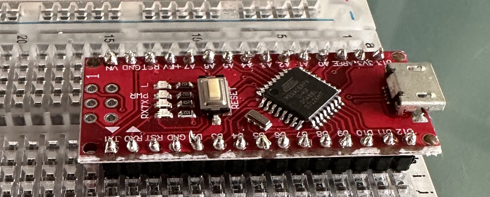
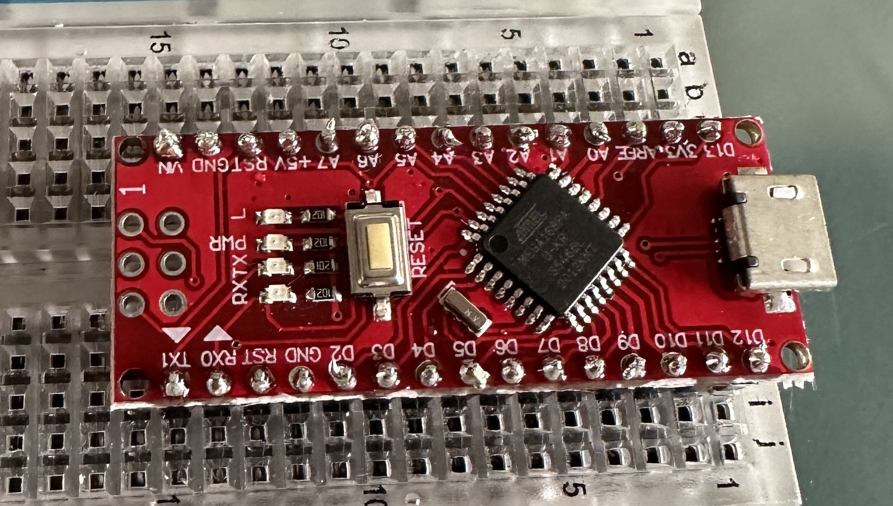
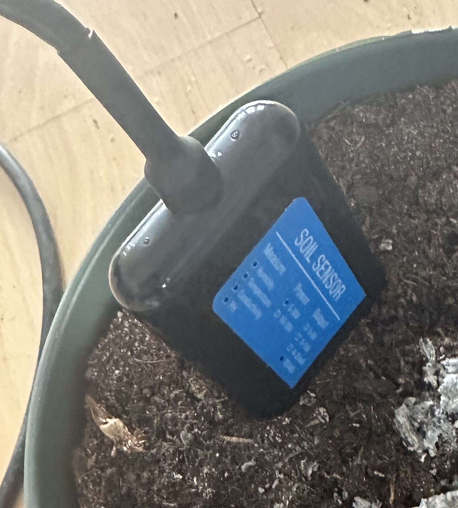
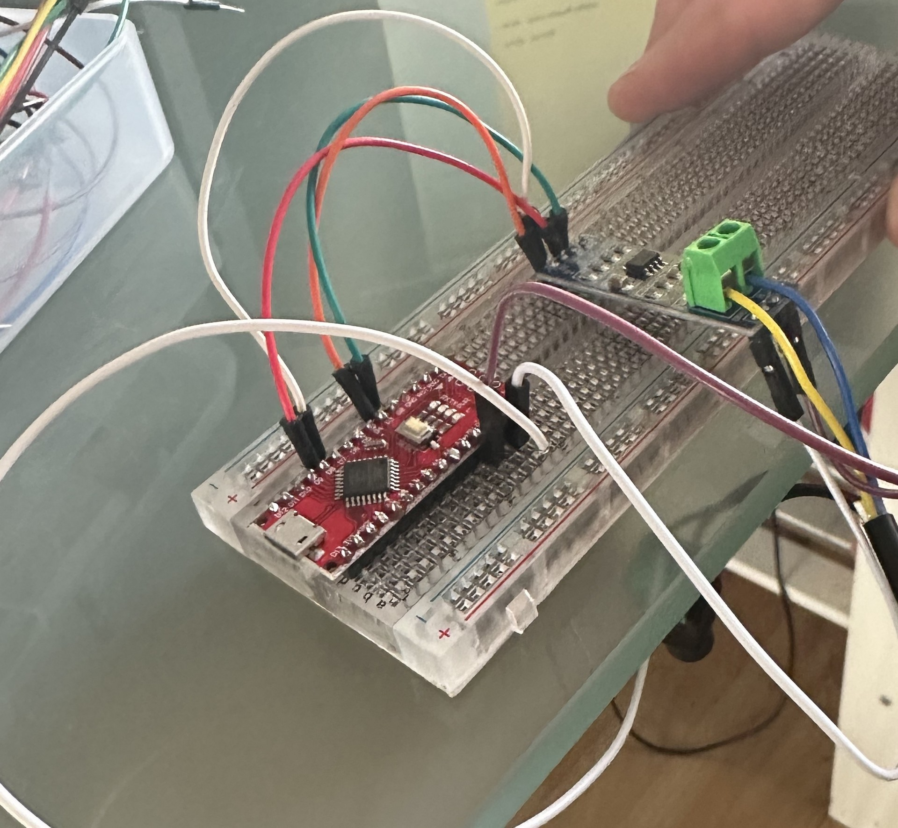
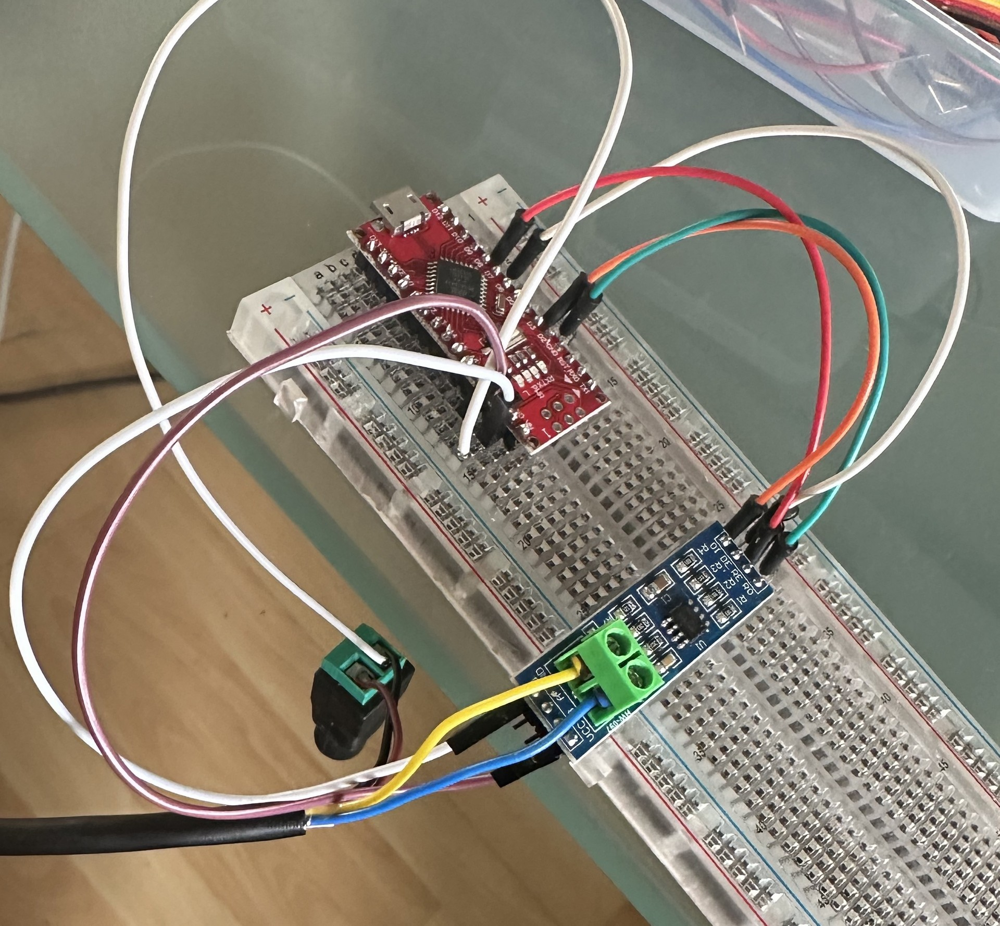

# 12:37 - Soldering a fresh ESP32

Starting with soldering a new ESP32. Yesterday I dropped the breadboard with my project prototype and with that the USB connector broke. :( I'm not a star with micro-soldering so it will be a fresh one.


# 13:20 - Wireguard VPN update... NPK RS-485 Sensor

Then I've got an update of my Wireguard VPN client which f*ck*d up my internet connection. :@ But back online now and decided that I will go for the RS-485 NPK Soil Moisture sensor. I've been having some issues with connecting the sensor and getting values from the sensor using the MAX485 Modbus module. Now it's a fresh day so this time it should work.

## Wiring Modbus MAX485 Module

| Pin module | Pin Arduino Nano | Description                                                                                |
| :--------: | :--------------: | ------------------------------------------------------------------------------------------ |
|    VCC     |    5v            | Power supply pin. Connecting to the 5v to power-up the module via the Nano                 |
|     A      |    N/A           | Non-Inverting receiver input and driver output. Will be connected with A on the NPK Sensor |
|     B      |    N/A           | Inverting receiver input and driver output. Will be connected with B on the NPK Sensor     |
|    GND     |    GND           | Ground pin which is connected to the GND pin on the Nano                                   |
|     RO     |    2             | Receiver output pin. Connected to an RX pin of the Nano                                    |
|     RE     |    8             | Receiver output enable pin. To enable, it is set at a LOW state                            |
|     DE     |    7             | Driver output enable pin. To enable, it is set at a HIGH state                             |
|     DI     |    3             | Driver output pin. Connected to an TX pin of the Nano                                      |


# 13:59 - ~~Start coding~~ - Back to the drawingboard

# 14:35 Arduino Nano
Trying to find more information on how to connect the NPK Soil Sensor with the **MAX485** Modbus Module to a ESP32 seems to be hard, all documentation I've found is about the Modbus connected to a Arduino and besides that I've found multiple posts about the setup to an ESP32 is not working. I can't believe thats true, but to keep the process going on I'm going to solder a Arduino Nano and when that works I will send the measurements to the ESP32 so that can send the data over ESP-NOW to the slave controller that will send the measurements to the database. The ESP32 only solution can be figured out later. For now, soldering the Nano! :)








# 14:52 - Wiring











# 15:07 - Start coding (again)
I've been written a sketch based on an example. The sketch compiled successfully but I'm not getting any values back. Going to check the wiring to see if it's all correct. If so, then I need to get my multi-meter and see if all the power is is right.

## Used code
```
#include <SoftwareSerial.h>
#include <Wire.h>

#define RE 8
#define DE 7

const byte nitro[] = {0x01,0x03, 0x00, 0x1e, 0x00, 0x01, 0xe4, 0x0c};
const byte phos[] = {0x01,0x03, 0x00, 0x1f, 0x00, 0x01, 0xb5, 0xcc};
const byte pota[] = {0x01,0x03, 0x00, 0x20, 0x00, 0x01, 0x85, 0xc0};

byte values[11];
SoftwareSerial mod(2,3);

void setup() {
  Serial.begin(9600);
  mod.begin(9600);
  pinMode(RE, OUTPUT);
  pinMode(DE, OUTPUT);

  Serial.println();
  Serial.println();
  Serial.println("NPK Sensor");
  Serial.print("Initializing");

  delay(3000);
}

void loop() {
  byte val1,val2,val3;
  val1 = nitrogen();
  delay(250);
  val2 = phosphorous();
  delay(250);
  val3 = potassium();
  delay(250);

  Serial.print("Nitrogen: ");
  Serial.print(val1);
  Serial.println(" mg/kg");
  Serial.print("Phosphorous: ");
  Serial.print(val2);
  Serial.println(" mg/kg");
  Serial.print("Potassium: ");
  Serial.print(val3);
  Serial.println(" mg/kg");
  delay(2000);
}

byte nitrogen() {
  digitalWrite(DE, HIGH);
  digitalWrite(RE, HIGH);
  delay(10);
  if(mod.write(phos,sizeof(phos))==8) {
    digitalWrite(DE, LOW);
    digitalWrite(RE, LOW);
    for(byte i = 0 ; i < 7 ; i++) {
      // Serial.print(mod.read(), HEX);
      values[i] = mod.read();
      }

      Serial.println();
  }
  return values[4];
}

byte phosphorous() {
  digitalWrite(DE, HIGH);
  digitalWrite(RE, HIGH);
  delay(10);
  if(mod.write(phos,sizeof(phos))==8) {
    digitalWrite(DE, LOW);
    digitalWrite(RE, LOW);
    for(byte i = 0 ; i < 7 ; i++) {
      // Serial.print(mod.read(), HEX);
      values[i] = mod.read();
      }

      Serial.println();
  }
  return values[4];
}

byte potassium() {
  digitalWrite(DE, HIGH);
  digitalWrite(RE, HIGH);
  delay(10);
  if(mod.write(phos,sizeof(phos))==8) {
    digitalWrite(DE, LOW);
    digitalWrite(RE, LOW);
    for(byte i = 0 ; i < 7 ; i++) {
      // Serial.print(mod.read(), HEX);
      values[i] = mod.read();
      }

      Serial.println();
  }
  return values[4];
}
```


# 15:34 - Debugging
## Checking wiring
I'm in doubt of the GND from the NPK sensor if that one is actually connected since I used a cable without the core being soldered. Trying a better cable wasn't the solution for the GND cable.

## New MAX485 Modbus module
To be sure that I didn't broke the modbus module I've installed a new one.

## New sketch
The previous sketch was based on a NPK sensor only measuring NPK, since I use a sensor measuring also pH and Temperature I'm going to rewrite the sketch to see if it makes any difference. I wouldn't expect that based on how RS-485 works. But you never know

# 08:38 - The next day (20-03-2023)
Finally I'v found a sketch that actually seems to work! Calibrating the sensor is still something on the todo list, but I've some numbers that I can actually link to the measurement that are been done.

Wrapping it up for now! Soon more on the Al Blundy project!

Ow.... Here is the used code!

It can be hard to find the correct Inquiry Message for the sensor. In the manual of the sensor you would find most of the needed information, except for the CRC Error Checksum, this can be calculated on this site; [CRC Calc](https://crccalc.com/)

```
#include <SoftwareSerial.h>

#define RE 8
#define DE 7

const uint32_t TIMEOUT = 500UL;

const byte humidity[] = {0x01, 0x03, 0x00, 0x00, 0x00, 0x01, 0x84, 0x0a}; // Values from config tool
const byte temperature[] = {0x01, 0x03, 0x00, 0x01, 0x00, 0x01, 0xd5, 0xca}; // Values from config tool
const byte conductivity[] = {0x01, 0x03, 0x00, 0x02, 0x00, 0x01, 0x25, 0xca}; // Values from config tool
const byte ph[] = {0x01, 0x03, 0x00, 0x03, 0x00, 0x01, 0x74, 0x0a}; // Values from config tool

byte values[11];
SoftwareSerial mod(2, 3); // Rx pin, Tx pin

void setup() {
  Serial.begin(4800);
  mod.begin(4800);
  pinMode(RE, OUTPUT);
  pinMode(DE, OUTPUT);

  delay(500);
}

void loop() {
  byte val1, val2, val3, val4;

  Serial.print("Humidity: ");
  val1 = get_humidity();
  Serial.print(val1);
  Serial.print(" %RH\n\n");
  delay(1000);

  Serial.print("Temperature: ");
  val2 = get_temperature();
  Serial.print(val2);
  Serial.print(" *C\n\n");
  delay(1000);

  Serial.print("Electric Conductivity (EC): ");
  val3 = get_conductivity();
  delay(1000);
  Serial.print(val3);
  Serial.print(" mS/m\n\n");

  Serial.print("pH: ");
  val4 = get_ph();
  delay(1000);
  Serial.print(val4);
  Serial.print(" pH\n\n");

  delay(5000);
}

byte get_humidity() {
  uint32_t startTime = 0;
  uint8_t  byteCount = 0;
  
  digitalWrite(DE, HIGH);
  digitalWrite(RE, HIGH);
  delay(10);
  mod.write(humidity, sizeof(humidity));
  mod.flush();
  digitalWrite(DE, LOW);
  digitalWrite(RE, LOW);

  startTime = millis();
  while ( millis() - startTime <= TIMEOUT ) {
    if (mod.available() && byteCount<sizeof(values) ) {
      values[byteCount++] = mod.read();
      printHexByte(values[byteCount-1]);
    }
  }
  Serial.println();
  return values[4];
}

byte get_temperature() {
  uint32_t startTime = 0;
  uint8_t  byteCount = 0;
  
  digitalWrite(DE, HIGH);
  digitalWrite(RE, HIGH);
  delay(10);
  mod.write(temperature, sizeof(temperature));
  mod.flush();
  digitalWrite(DE, LOW);
  digitalWrite(RE, LOW);

  startTime = millis();
  while ( millis() - startTime <= TIMEOUT ) {
    if (mod.available() && byteCount<sizeof(values) ) {
      values[byteCount++] = mod.read();
      printHexByte(values[byteCount-1]);
    }
  }
  Serial.println();
  return values[4];
}

byte get_conductivity() {
  uint32_t startTime = 0;
  uint8_t  byteCount = 0;
  
  digitalWrite(DE, HIGH);
  digitalWrite(RE, HIGH);
  delay(10);
  mod.write(conductivity, sizeof(conductivity));
  mod.flush();
  digitalWrite(DE, LOW);
  digitalWrite(RE, LOW);

  startTime = millis();
  while ( millis() - startTime <= TIMEOUT ) {
    if (mod.available() && byteCount<sizeof(values) ) {
      values[byteCount++] = mod.read();
      printHexByte(values[byteCount-1]);
    }
  }
  Serial.println();
  return values[4];
}

byte get_ph() {
  uint32_t startTime = 0;
  uint8_t  byteCount = 0;
  
  digitalWrite(DE, HIGH);
  digitalWrite(RE, HIGH);
  delay(10);
  mod.write(ph, sizeof(ph));
  mod.flush();
  digitalWrite(DE, LOW);
  digitalWrite(RE, LOW);

  startTime = millis();
  while ( millis() - startTime <= TIMEOUT ) {
    if (mod.available() && byteCount<sizeof(values) ) {
      values[byteCount++] = mod.read();
      printHexByte(values[byteCount-1]);
    }
  }
  Serial.println();
  return values[4];
}

void printHexByte(byte b)
{
  Serial.print((b >> 4) & 0xF, HEX);
  Serial.print(b & 0xF, HEX);
  Serial.print(' ');
}
```
Reference: [Arduino forums Soil 7 in 1 Sensor](https://forum.arduino.cc/t/soil-sensor-7-in-1-print-mixed-values/1067383/12) | __Thanks [markd833](https://forum.arduino.cc/u/markd833)!__

# Monday - 11:59

Not done yet with the RS485 sensor, but I'm glad to see that I finally have measurement values back! Next step is to try it one more time to get it running on a ES32. Or I need to send the values from the Nano to the ESP32 to send it to the ESP-NOW network.
